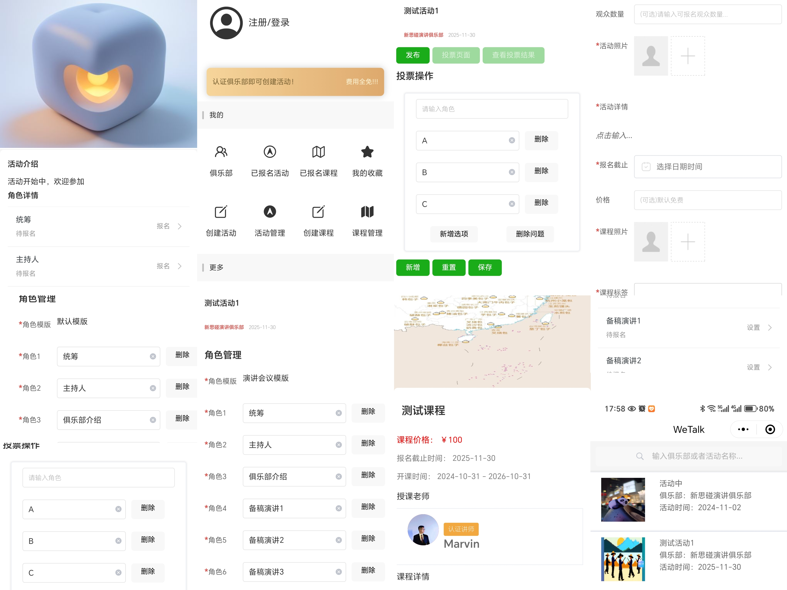

# YourCourse

OpenSource Activity|Course Management Mini Program Application
开源的活动报名，课程报名微信小程序

## 项目演示

### 快速预览 / Overview



### 线上体验地址 / Online Demo


## 版本更新历史 / Release Logs

## 1.0

* 主页 | 查看活动列表，搜索
* 主页 | 查看活动详情
* 主页 | 查看俱乐部介绍页面
* 主页 | 关注和加入俱乐部
* 课程 | 查看课程列表
* 课程 | 查看课程详情，报名活动
* 课程 | 讲师介绍页
* 我的 | 用户登录
* 我的 | 申请CLUB和课程导师
* 我的 | CLUB管理员创建活动
* 我的 | CLUB管理员创建课程
* 我的 | CLUB管理员查看活动和课程报名情况

## 2.0

* 活动 | 删除
* 活动 | 报名角色管理
* 活动 | 报名统计
* 活动 | 投票
* 俱乐部 | 添加管理员，删除管理员
* 账号 | 账号设置，退出登录
* 联系我们 | 在线客服  


## 部署架构 / Deployment Architecture

* 前端：微信小程序 
* 后端：JAVA SprintBoot
* 数据库： postgres


## 技术栈 / Tech Stack

### 前端 / Frontend

* hbuilder / vue / uniapp
* wechat mini program

### 后端  / Backend

* JAVA 17
* gradle 
* sprintboot 3.0.0
* springCloudVersion 2022.0.0-RC2
* mybatis, mybatis-plus
* auth0 jwt

### 基础设施 / Infra
* postgres 12
* docker, docker compose

### CICD
* github workflow


## 贡献 / Contributing

* 创建代码分支

```shell
Git branch <branch-name>
git checkout <branch-name>
```
* 参与开发 
* 提交分支请提交PR
* Repo Admin会定期Review然后merge并发布到网站

```shell
git commit -m "请准确描述提交内容, 并squash多次commit"
git push
```

## 本地编译运行 / Localrun

### 前端

```text
* 使用hbuilder程序导入yourcourse
* 右击wetalk，选择 publish-> Wechat Program
* 打开微信小程序开发客户端
* 导入小程序查看运行效果
```

### 后端数据库设置 

进入API local， 执行如下脚本

```shell
docker-compose up -d
```

### 后端

进入Src/main/resources目录，配置Application-local项目启动参数，执行命令

```shell
./gradlew clean build
ACTIVE_PROFILE=local ./gradlew bootRun
``
